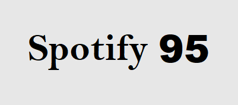
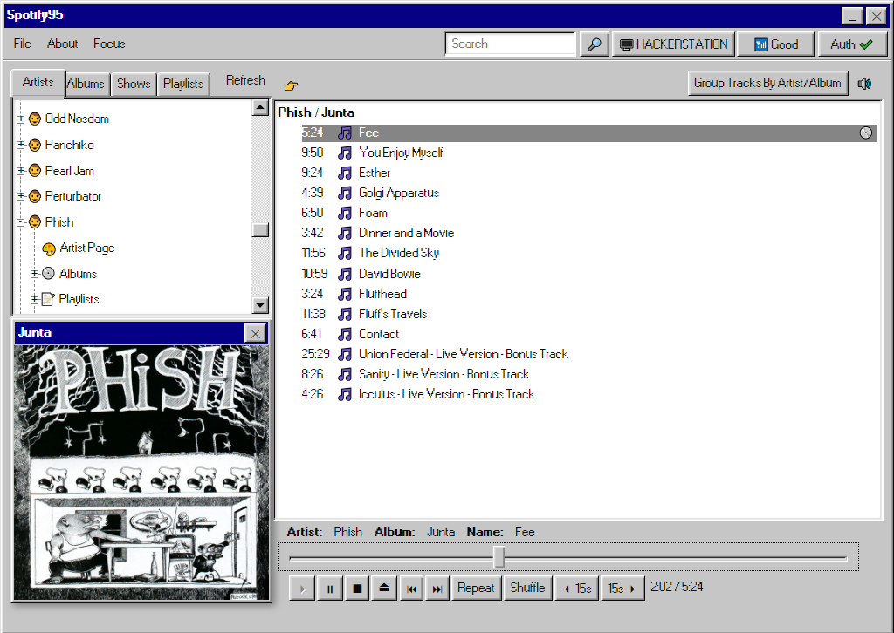
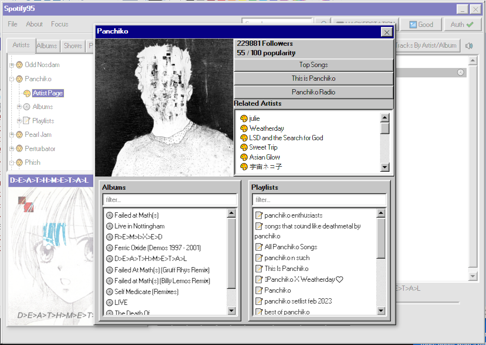
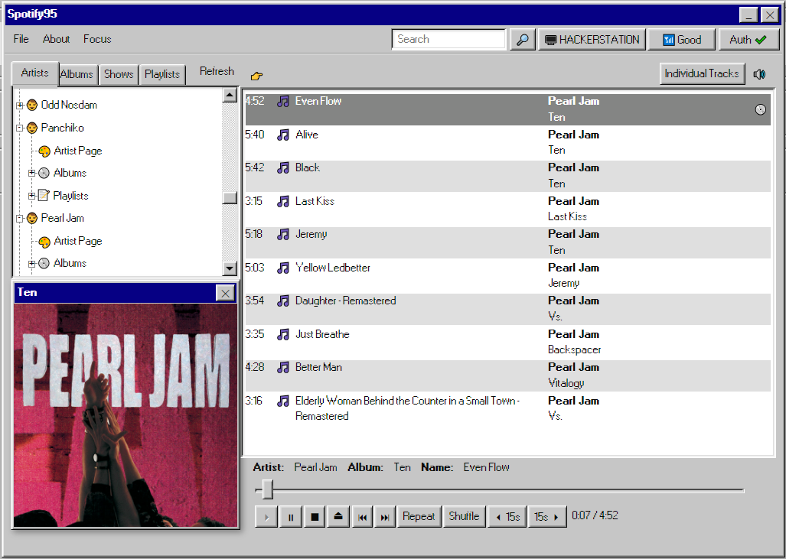
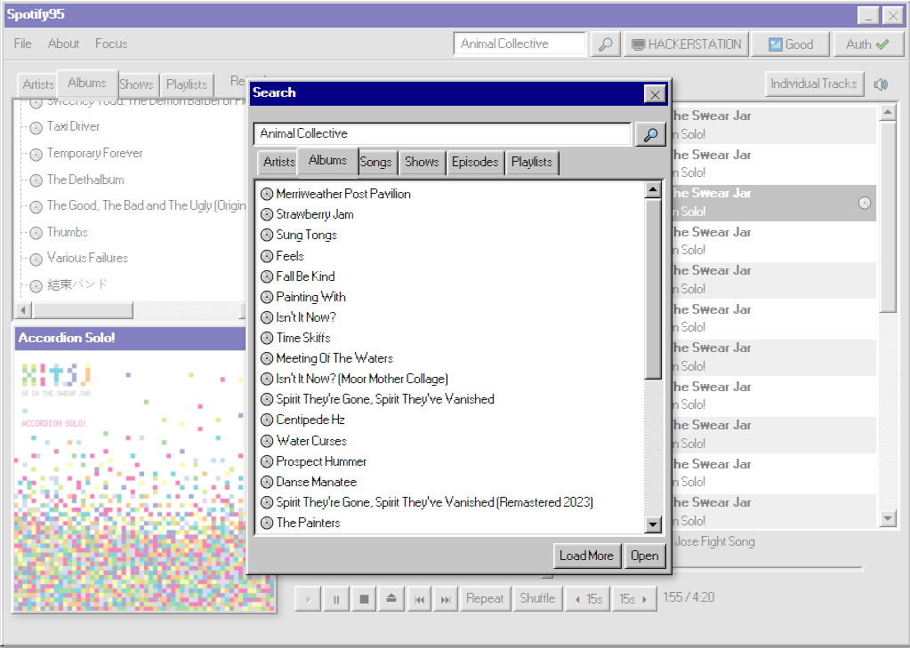
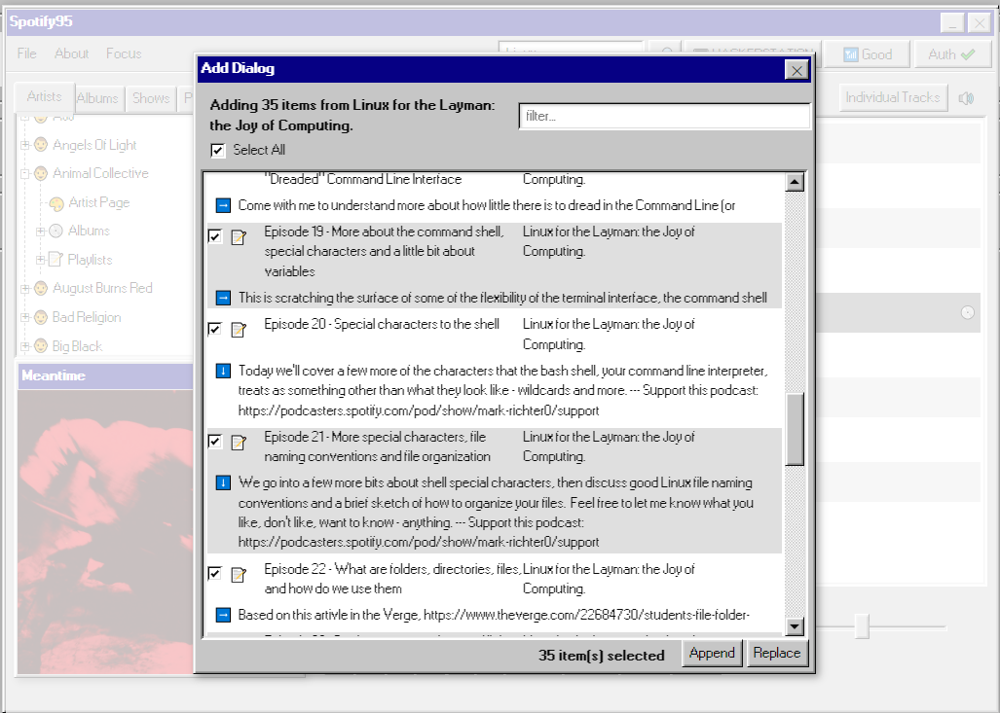

## What

An electron Spotify frontend utilizing stylish React95.

## Development

Runs from ./src -- npm install && npm run start

## Install

I'm working on getting releases up. For now, clone this repository, run npm install && npm run package, and you'll have an executable in the build folder.

## Screens

